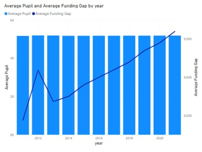
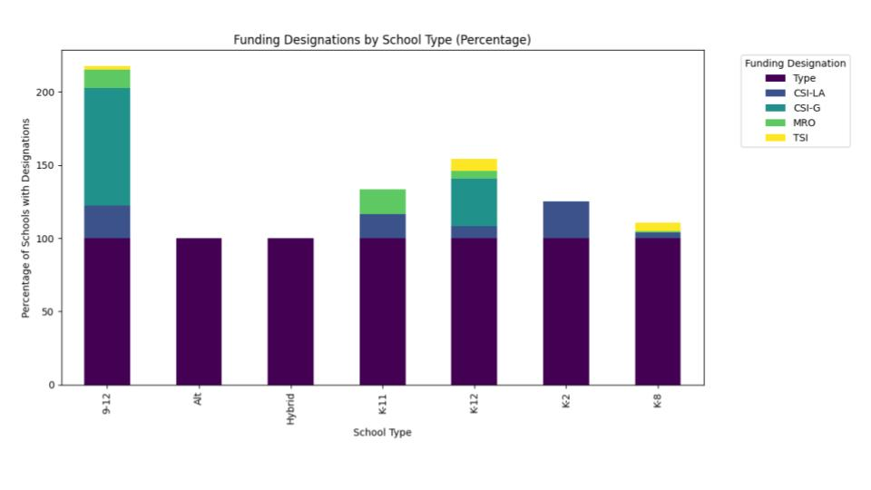
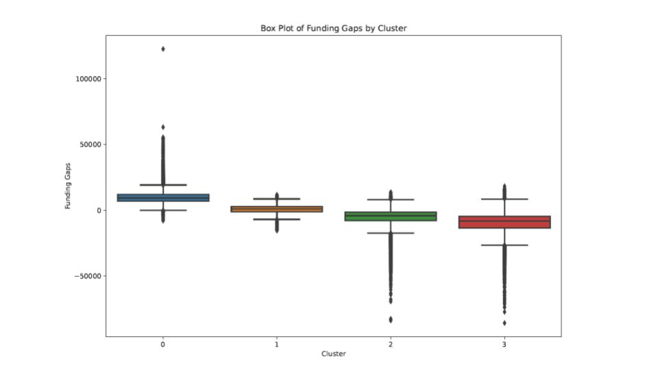

# School Funding in the Spotlight: Data Science for Educational Equity

## Background

The "School Funding in the Spotlight" project, conducted by the Unit for Data Science and Analytics in Fall 2024, critically examines the hidden dynamics of K-12 school funding in the United States. This project investigates whether and how the allocated funding supports schools in serving students of all backgrounds.

The analysis utilizes data from the National Center for Education Statistics (NCES), U.S. Census Bureau, and school finance records. The dataset spans from 2009 to 2019 and includes details on per-pupil funding across U.S. school districts. It also incorporates demographic information such as race/ethnicity, poverty levels, and the percentage of students in Special Education (SPED) or English Language Learner (ELL) programs.

## Executive Summary

Financial resources play a critical role in providing quality education. However, the allocation of these resources is often unequal due to reliance on local property taxes. This project leverages data science methodologies to identify patterns and predict which states or school districts might underfund students.

### Key Analyses

1. **Arizona-specific Analysis:** Examination of federal funding patterns and their correlation with student demographics.
2. **K-means Clustering:** Identifying distinct funding gap categories and analyzing them through demographic variables.
3. **Generalized Linear Model (GLM):** Quantifying the relationship between poverty levels and funding gaps.

Findings suggest that performance disparities persist across different student subgroups, particularly in K-8 schools. Native American and African American students are disproportionately affected, highlighting the need for targeted educational support.

## Insights

### 1. Arizona Federal School Funding

- **Increasing Funding Gaps:** Over the years, Arizona has experienced a growing gap between federal school funding and the average pupil intake. Possible causes include:

  - Inflationary pressures
  - Variations in staff and non-staff pay
  - Increased administrative and maintenance costs

- **Disparities by School Type:** High school-level institutions (grades 9-12) receive more funding, especially in Maintenance and Operations (MRO) and Comprehensive Support and Improvement Grants (CSI-G). Conversely, alternative, hybrid, and early education schools (K-8) receive less funding.

- **Underperforming Subgroups:** K-8 schools exhibit significant performance gaps. Native American and African American students are particularly affected, emphasizing the need for tailored interventions and resource allocation.

### 2. K-means Cluster Analysis

- **Clustering Methodology:** Both the Elbow Method and Silhouette Score identified four distinct funding gap clusters.
- **Poverty and Funding Gaps:** Analysis reveals that higher poverty levels are consistently associated with larger funding gaps. These gaps are further exacerbated by demographic factors such as race, SPED, and ELL status.

### 3. Generalized Linear Model (GLM)

- **Model Insights:**

  - Dependent Variable (DV): Funding Gap
  - Model Family: Gaussian
  - Log-Likelihood: -1.6893e+05
  - Deviance: 77919

- **Significance:** The predictor variable (poverty) has a p-value less than 0.005, indicating a statistically significant relationship between poverty levels and school funding gaps.

## Recommendations

1. **Targeted Resource Allocation:** Prioritize funding for underperforming subgroups, especially Native American and African American students in K-8 settings.

2. **Policy Adjustments:** Advocate for reforms in state and federal funding formulas to reduce reliance on local property taxes and mitigate disparities.

3. **Enhanced Monitoring:** Implement regular audits and analysis to track the effectiveness of funding interventions over time.

4. **Further Research:** Continue investigating additional variables that influence educational outcomes, such as teacher quality, community engagement, and socio-economic factors.

## Next Steps

The project team will continue analyzing funding equity, with future initiatives including the publication of an article summarizing findings and further collaboration with policymakers. For additional information and access to the project's data and models, please visit the Unit for Data Science GitHub repository:

[GitHub Repository](https://github.com/UnitForDataScience/Projects-Fall-2024/tree/main/School%20Funding%20in%20the%20Spotlight/Data)

### Acknowledgments

Special thanks to project mentor Abimelec Mercado Rivera and Kerri Rittschof for their support and guidance.

